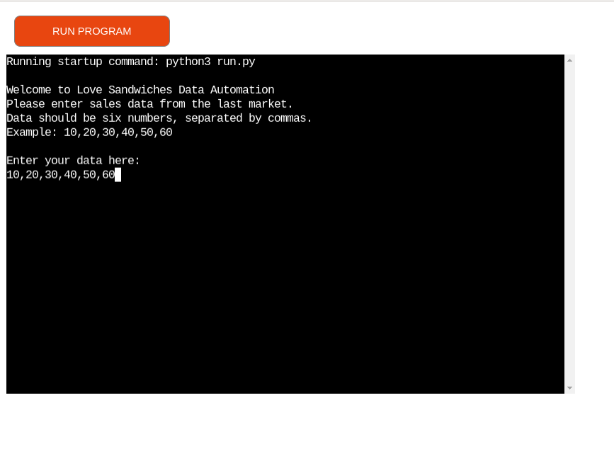
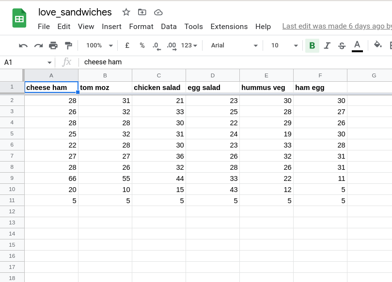

# Love Sandwitches
A command line based Python program to handle data  automation for a fictional sandwich company.
Love Sandwiches runs a local market stall, selling  a small range of sandwiches.
For each market day, their staff pre-make stock to sell. If they sell out of a particular sandwich, their staff make extra for their customers. And the unsold  ones are thrown away at the end of the day.

Goal of this excercise is to write a Python program that will collect the company’s market day sales data,  
calculate the surplus for the day, and produce  recommendations for the number of each sandwich  
to make for the next market. The goal is to  save the company staff time by automating a  
repetitive task, and help reduce the surplus  by better predicting sales for future markets.
To achieve this, Python program is wired to interact with a Google Sheet, so that we can push and pull  data to and from the spreadsheet.

# Technologies used
* HTML5
* CSS
* JavaScript
* Python
* Use of Google Sheets API

# Screenshots

Deployed on Heroku

Google sheets

## Constraints

The deployment terminal is set to 80 columns by 24 rows. That means that each line of text needs to be 80 characters or less otherwise it will be wrapped onto a second line.

# Demo

App demo is deployed on Heroku

https://ci-love-sandwiches-walkthrough.herokuapp.com/

# Deployment

To deploy theproject locally, clone the repository with:

`https://github.com/Azelliott/love-sandwiches`